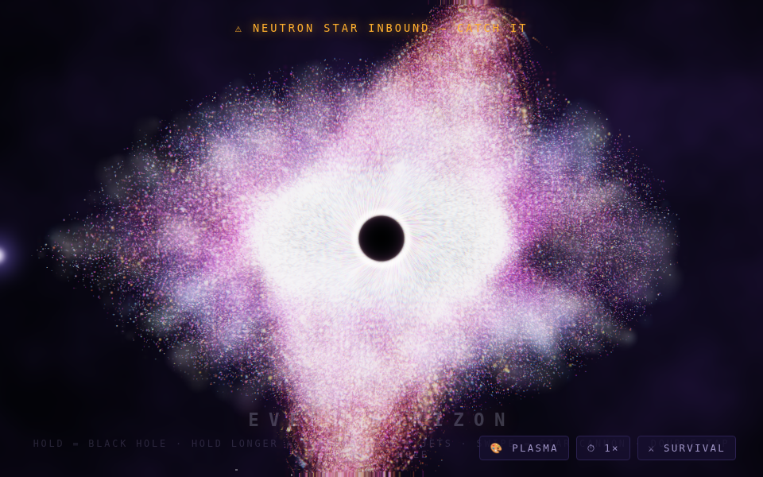

# 🌌 FABLE 5 · Galaxy Lab

Three interactive WebGL space toys that run in any browser — phone or computer, no install, works offline.

## ▶ Play

Once GitHub Pages is enabled (see below), everything is live at:

- **Galaxy Lab home** — `https://hi43.github.io/Gorilla-tag-Mods/`
- **Event Horizon** — `https://hi43.github.io/Gorilla-tag-Mods/fable-blackhole.html`
- **Supernova** — `https://hi43.github.io/Gorilla-tag-Mods/fable-supernova.html`
- **Power Readout** — `https://hi43.github.io/Gorilla-tag-Mods/fable-power-core.html`

Or download any `.html` file and double-click it — everything is self-contained and runs offline.

## 🕳 Event Horizon — controls

| Do this | Get this |
|---|---|
| **Hold** | Open a black hole with real gravitational lensing |
| **Keep holding** | It goes supermassive — relativistic jets, dimming universe |
| **Release** | Detonation, ranked SHOCKWAVE → GALAXY BREAKER |
| **Two fingers** | Two holes — drag them together for a BINARY MERGER |
| **Fast swipe** | STAR CANNON comet that explodes on impact |
| **Double-tap** | WHITE HOLE that erupts stars outward |
| **🎨 button** | Galaxy skins: plasma / ice / lava / monke |
| **⏱ button** | Time warp: 1× / 3× / slow-motion ⅓× |
| **⚔ button** | 60-second survival score attack + shareable score card |
| **Tilt phone** | Look around the galaxy in 3D |
| **Catch the neutron star** | +20,000 bonus when one tears through |

Detonations chain into combos (×2–×9). High scores save on your device.

## ⚙️ Tech

- 120,000 GPU particles (55,000 on phones) in a single WebGL points pass
- Post-processing pipeline: gravitational lensing with chromatic aberration, HDR bloom, motion trails, procedural fbm nebula, shockwave refraction, filmic tonemapping
- Synthesized reactive audio (WebAudio) — ambient drone that darkens as holes grow, sub-bass drops on big detonations
- Zero dependencies, one file per toy

## 🔧 Enabling GitHub Pages

1. Open this repo on GitHub → **Settings** → **Pages**
2. Under **Build and deployment** → Source: **Deploy from a branch**
3. Branch: `claude/capabilities-visual-4krjrk` · Folder: `/ (root)` → **Save**
4. Wait ~1 minute, then visit `https://hi43.github.io/Gorilla-tag-Mods/`
